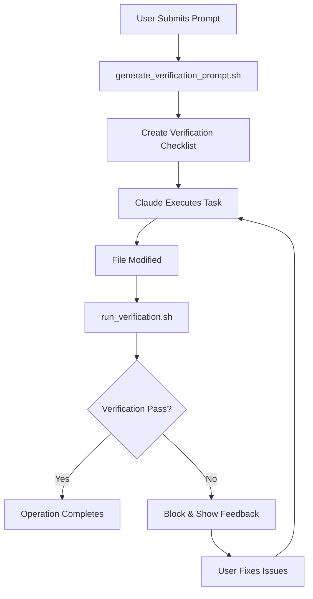

# 🪝 Claude Code Hooks Integration

This directory contains automated verification hooks that integrate the MCP Gemini Adjudicator directly into Claude Code's workflow.

## 🎯 What This Does

These hooks create a **closed-loop verification system** where:
1. Every task gets a verification checklist automatically generated
2. Every file modification gets automatically verified
3. Failed verifications block the operation and provide feedback

## 🔧 How to Enable

### Option 1: Using Claude Code Command
```bash
/hooks
```
Then add the configuration from `.claude/settings.json`

### Option 2: Manual Configuration
Edit `.claude/settings.json` and add:

```json
{
  "hooks": {
    "UserPromptSubmit": [
      {
        "matcher": "*",
        "hooks": [
          {
            "type": "command",
            "command": ".claude/hooks/generate_verification_prompt.sh"
          }
        ]
      }
    ],
    "PostToolUse": [
      {
        "matcher": "WriteFile|Replace|Edit|MultiEdit",
        "hooks": [
          {
            "type": "command",
            "command": ".claude/hooks/run_verification.sh"
          }
        ]
      }
    ]
  }
}
```

## 📋 Hook Scripts

### `generate_verification_prompt.sh`
- **Triggers on**: Every user prompt submission
- **Purpose**: Creates a verification checklist for the task
- **Output**: Saves verification criteria to `last_verification_prompt.txt`

### `run_verification.sh`
- **Triggers on**: File modifications (WriteFile, Edit, Replace, MultiEdit)
- **Purpose**: Verifies the changes against the checklist
- **Action**: Blocks operation if verification fails

## 🔄 Workflow



## 🚀 Activation

To activate with real MCP server calls:

1. **Update `generate_verification_prompt.sh`** (line 40-52):
```bash
# Replace placeholder with actual Gemini call
llm_response_json=$(curl -s -X POST \
  "https://generativelanguage.googleapis.com/v1/models/gemini-2.0-flash-exp:generateContent?key=$GEMINI_API_KEY" \
  -H "Content-Type: application/json" \
  -d "{
    \"contents\": [{\"parts\": [{\"text\": \"$meta_prompt\"}]}],
    \"generationConfig\": {\"temperature\": 0.3}
  }" | jq -r '.candidates[0].content.parts[0].text')
```

2. **Update `run_verification.sh`** (line 44-63):
```bash
# Replace placeholder with actual MCP server call
adjudicator_response=$(node /path/to/index.mjs verify_with_gemini \
  --artifact "$artifact_content" \
  --task "verify_completeness" \
  --tests_json "{\"verification_prompt\": \"$verification_prompt\"}" \
  --ground_with_search false)
```

## 📊 Example Verification

When you ask Claude to "Update all blog posts with new sections", the system:

1. **Generates Checklist**:
   - ✅ All posts must have "before and after" section
   - ✅ All posts must have "The flow to do this" section
   - ✅ All posts must have "I want this savings" button

2. **Verifies Each Change**:
   - Checks every modified file
   - Counts completed vs missing elements
   - Provides specific feedback

3. **Returns Verdict**:
   ```json
   {
     "verdict": "FAIL",
     "detailed_feedback": "Posts 2, 5, 8 missing button. Post 5 missing flow section."
   }
   ```

## 🛡️ Security Notes

- Scripts run with your environment permissions
- Only writes to project directory
- Logs stored in `.claude/hooks/hooks.log`
- API keys read from environment variables

## 🔍 Debugging

Check the log file for issues:
```bash
tail -f .claude/hooks/hooks.log
```

## 💡 Tips

- Keep verification prompts specific and measurable
- Use structured task descriptions for better checklists
- Review logs to improve verification accuracy
- Combine with search grounding for fact-checking tasks